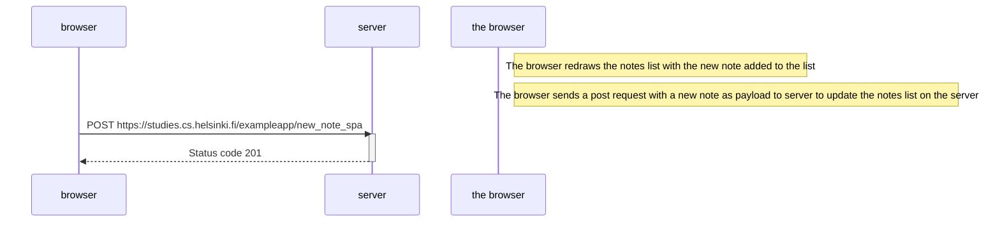

```mermaid
sequenceDiagram
    participant browser
    participant server

    Note right of the browser: The browser redraws the notes list with the new note added to the list
    Note right of the browser: The browser sends a post request with a new note as payload to server to update the notes list on the server

    browser->>server: POST https://studies.cs.helsinki.fi/exampleapp/new_note_spa
    activate server
    server-->>browser: Status code 201
    deactivate server

```